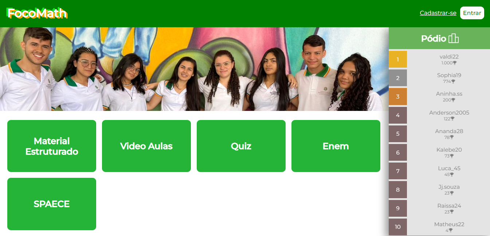

# FocoMath

Trata-se de uma plataforma de estudos que oferece acesso a materiais de estudo em formato de PDF, vídeos explicativos, e incorpora elementos de gamificação. A plataforma inclui um pódio que classifica os alunos com base nos pontos obtidos por meio de quizzes realizados dentro da própria plataforma. Esse projeto envolveu a utilização das linguagens PHP, Javascript e SQL.

**Para acessar:** [LINK]([http://.rf.gd/](http://focomath.rf.gd/)http://focomath.rf.gd/) 
